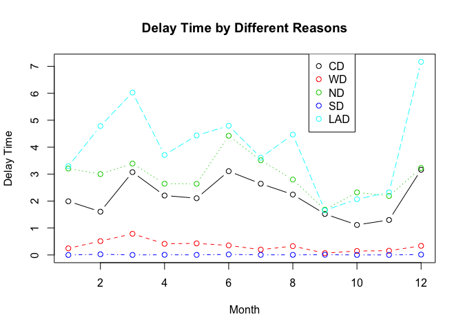
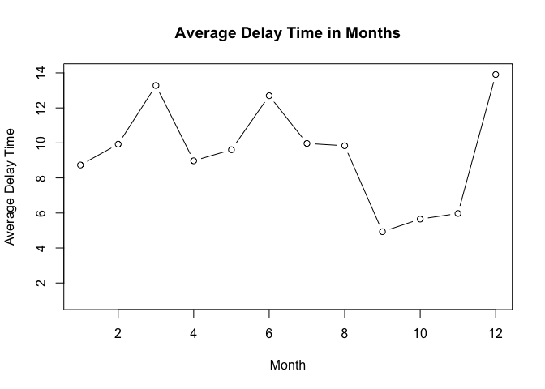
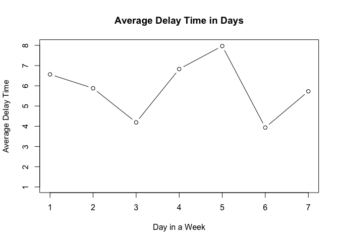
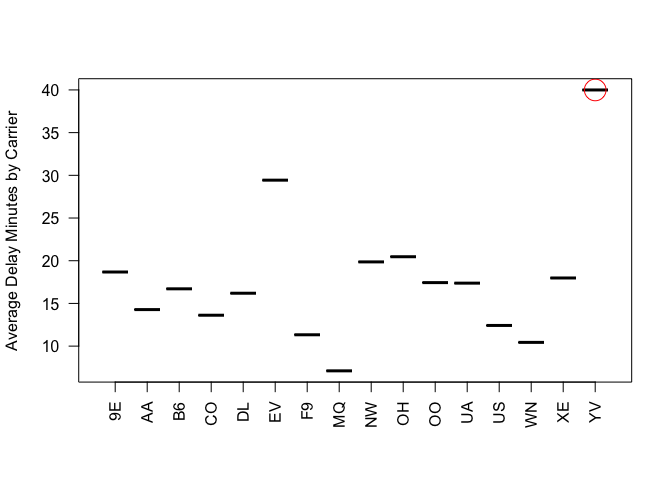
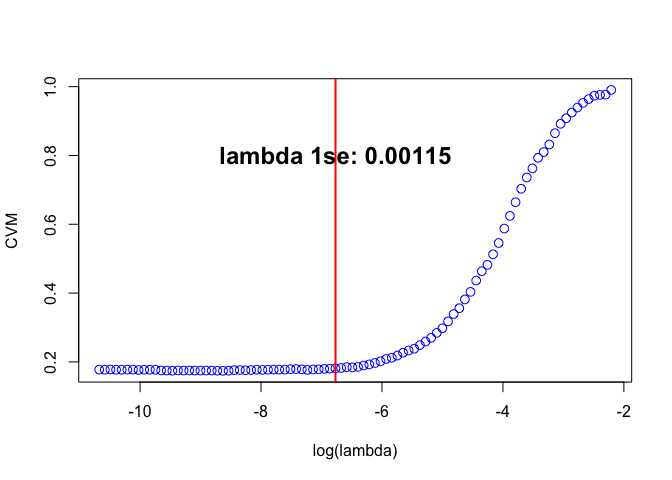
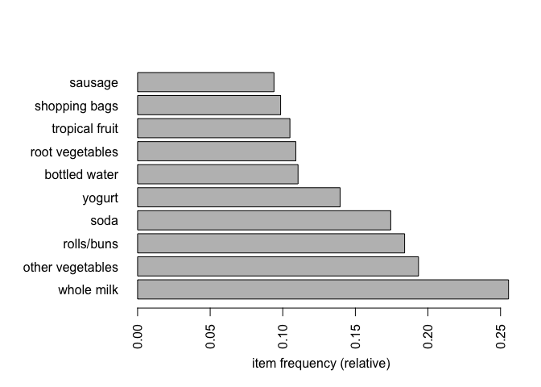
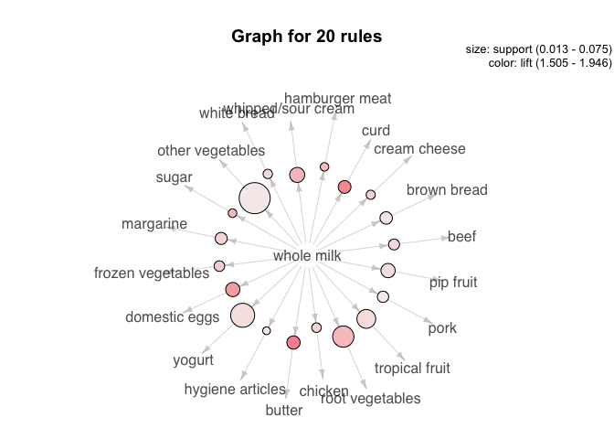
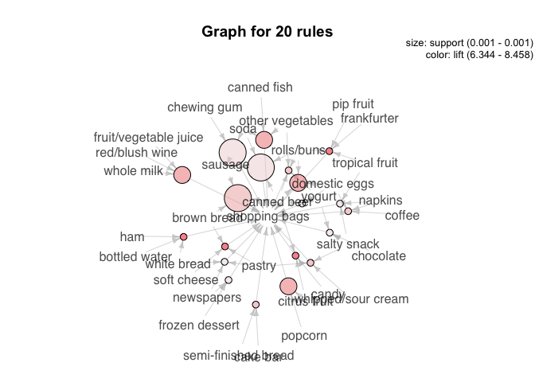

R assignment 2
================
8/20/2018

STA 380, Part 2: Exercises 2

Group: Jinming Li, Rulan Pan, Tianxin Huang, Yile Zhou

# Flights at ABIA

## The Worst Month for Flight Delays

``` r
#Read the data
abia = read.csv("/Users/yilezhou/Documents/GitHub/STA380-Assignment-2/ABIA.csv")
#Delay time for each month
CD = c()  #CarrierDelay
WD = c()  #WeatherDelay
ND = c()  #NASDelay
SD = c()  #SecurityDelay
LAD = c() #LateAircraftDelay
for(month in 1:12){
  df_temp = abia[which(abia$Month == month & abia$Origin == "AUS"), ]
  CD = c(CD, sum(df_temp$CarrierDelay, na.rm = TRUE)/nrow(df_temp))
  WD = c(WD, sum(df_temp$WeatherDelay, na.rm = TRUE)/nrow(df_temp))
  ND = c(ND, sum(df_temp$NASDelay, na.rm = TRUE)/nrow(df_temp))
  SD = c(SD, sum(df_temp$SecurityDelay, na.rm = TRUE)/nrow(df_temp))
  LAD = c(LAD,sum(df_temp$LateAircraftDelay, na.rm = TRUE)/nrow(df_temp))
}
df = data.frame(CarrierDelay = CD,
                WeatherDelay = WD,
                NASDelay = ND,
                SecurityDelay = SD,
                LateAircraftDelay =LAD,
                Sum = (CD + WD +ND +SD +LAD))
```

``` r
matplot(df[,1:5], type = "b", pch=1, col = 1:5, xlab = "Month", 
        ylab = "Delay Time", main = "Delay Time by Different Reasons")
legend(8.5,7.5, c("CD", "WD", "ND", "SD", "LAD"), col=1:5, pch=1)
```

<!-- -->

From the graph above, we could see LateAircraft delay plays a big role
in most months, especially in March and December. The Weather delay is
not a big problem in Austin, but it is a much bigger factor of flight
delay in March than other months.

``` r
plot(df[,6], type = "b", ylim=c(1, 14), xlab = "Month", 
     ylab = "Average Delay Time", main = "Average Delay Time in Months")
```

<!-- -->

From the average delay time through the year, we could see December,
March, and June are the top three longest flight delay months. And,
September, October and November are the three best months for flight in
Austin.

## The Days in a Week

``` r
delay = c()
for(day in 1:7){
  df_temp = abia[which(abia$DayOfWeek == day & abia$Origin == "AUS"), ]
  delay = c(delay, sum(df_temp$ArrDelay, na.rm = TRUE)/nrow(df_temp))
}
plot(delay, type = "b", ylim=c(1, 8), xlab = "Day in a Week", 
     ylab = "Average Delay Time", main = "Average Delay Time in Days")
```

<!-- -->

Friday is the worst day in a week, following by Monday. However,
Wednesday and Saturday are the two of the best days in a week for flight
in Austin.

## The Worst Carrier

``` r
DelayData = abia[which(abia$ArrDelay > 0), ]
carriers = unique(DelayData$UniqueCarrier)
meanCarrierDelay = c()
for(x in carriers){
  df_temp = DelayData[which(DelayData$UniqueCarrier == x), ]
  meanCarrier = mean(df_temp$CarrierDelay, na.rm = TRUE)
  meanCarrierDelay = c(meanCarrierDelay, meanCarrier)
}
meanCarrierDelay
```

    ##  [1] 18.678571 19.862069 16.709324 17.978723 17.436709 10.437655 14.277103
    ##  [8] 39.996416 20.466337 17.374419 13.617540  7.104603 12.420455 16.193772
    ## [15] 11.327635 29.433790

``` r
idx = which.max(meanCarrierDelay)
WorstCarrier = carriers[idx]
plot(carriers, meanCarrierDelay, type = "p", ylab = "Average Delay Minutes by Carrier", las =2)
points(WorstCarrier, max(meanCarrierDelay), type = "o", col = "red", cex = 3)
```

<!-- -->

YV, Mesa Airlines, is the worst Carrier in carrier delay for the year
2008 in Austin airport.

In conclusion, we recommand people take flight in September, October,
and November through the year, and take flight on Wednesday, Saturday.
However, if you must take a flight in busy days (Monday and Friday) or
in busy months (March, June and December), we recommand you don’t take
the flights of Mesa Airlines. Instead, American Eagle, Southwest
Airlines, Frontier and US Airways, these airline companies will make
your life much better.

# Author attribution

The goal of our team is to accurately predict the author based on the
text each author wrote. Given 2500 text files of each 50 author in the
train set and another 2500 text files of each 50 author in the test set,
I conducted the text mining and text analysis on the following order:

Train set:<br/> 1) Read all train set txt files into plain term
matrix<br/> 2) Converted 2500 train set documents of each 50 authors
from plainTerm matrix into corpus<br/> 3) Created train set
document-term matrix and remove spare terms<br/> 4) Built train set
TF-IDF matrix and remove those columns with 0 sum<br/> 5) Conducted PCA
on reducing the dimentiona of train set X variabels from 3327 to 341
(number of PCs that explained 50% variance)<br/> 6) Read 2500 train set
author labels and combined it with TF-IDF matrix<br/> 7) Cross-validated
out the best lambda for logistic regression<br/> 8) Used the best lambda
to fit the train set and got a logistic model.<br/> 9) Trained random
forest on train set<br/>

Test set:<br/> 10) Read all test set txt files into plain term
matrix<br/> 11) Converted 2500 test set documents of each 50 authors
from plainTerm matrix into corpus<br/> 12) Created test set
document-term matrix and remove spare terms with controlled column names
being the same as train set<br/> 13) Built test set TF-IDF matrix<br/>
14) Read 2500 test set author labels and combined it with TF-IDF
matrix<br/> 15) Used the logisitc model with best lambda in train set to
predict test set data<br/> 16) Used the random forest in train set to
predict test set data<br/>

#### Result:

Using logistic model, I achieved 81.88% accuracy under cross validation
setting with lambda 1se chosen but only received 2.52% accuracy when
predicting the test set. Using random forest, I achieved 81.96% accuracy
but only received 6.08% accuracy when predicting the test set.

#### Conclusion:

The reason as for why we achieve high accuracy in train set data even
with cross validation but low accuracy in test set data might be the
fact that test set data is extremely different from the train set data.
When we are trying to build model to predict test set based on train
set, our assumption is that the data in test set would be pretty similar
to the train set, so even if we didn’t see this piece of data in the
train set, we can still predict more or less accurately to the test set.
However, in this particular scenario, train set data is unfamiliar with
test set data. For example, AaronPressman wrote two document a and b in
the training set. The TF-IDF vector for a and b are similar (cosine
similarity measurement), so when we do cross validation on train set, we
are able to predict b accurately based on the information from a.
However, in the test set, AaronPressman also wrote another document c
which is very different from a and b. This is impossible to predict c
based on a and b. Our assumption again is that train set data and test
set data should more or less looks the same. If not, it is the same as
saying go predicting an Asian child that is yours based on his apperance
but you can only make judgement based on your two American kids, and no
more\! Hard to make a prediction, right? Same as here.

### Step 1: Read all train set txt files into plain term matrix

``` r
library(tm)
library(glmnet)
library(randomForest)
library(magrittr)
train_dir = dir('/Users/yilezhou/Documents/GitHub/STA380-Assignment-2/ReutersC50/C50train', full.names = TRUE)
test_dir = dir('/Users/yilezhou/Documents/GitHub/STA380-Assignment-2/ReutersC50/C50test', full.names = TRUE)
```

``` r
plaintable = function(filename){
  readPlain(elem = list(content = readLines(filename)), 
            id = NULL, language = 'en')
}
train50_plain = lapply(train_dir, dir, full.name = TRUE) %>% 
  unlist %>%
  lapply(., plaintable)
```

### Step 2: Converted 2500 train set documents of each 50 authors from plainTerm matrix into corpus

``` r
train50_corpus = Corpus(VectorSource(train50_plain))
train50_corpus = tm_map(train50_corpus, content_transformer(tolower))
train50_corpus = tm_map(train50_corpus, content_transformer(removeNumbers))
train50_corpus = tm_map(train50_corpus, content_transformer(removePunctuation))
train50_corpus = tm_map(train50_corpus, content_transformer(stripWhitespace))
train50_corpus = tm_map(train50_corpus, content_transformer(removeWords), stopwords('en'))
```

### Step 3: Created train set document-term matrix and remove spare terms

``` r
train50_dtm = DocumentTermMatrix(train50_corpus)
train50_dtm = removeSparseTerms(train50_dtm, 0.99)
train50_dtm # reduce the number of terms from 32574 to 3344
```

    ## <<DocumentTermMatrix (documents: 2500, terms: 3344)>>
    ## Non-/sparse entries: 422971/7937029
    ## Sparsity           : 95%
    ## Maximal term length: 20
    ## Weighting          : term frequency (tf)

### Step 4: Built train set TF-IDF matrix and remove those columns with 0 sum

``` r
train50_tfidf = weightTfIdf(train50_dtm)
train50_tfidf = as.matrix(train50_tfidf)
zerocol = which(colSums(train50_tfidf) == 0)
train50_tfidf = train50_tfidf[, -zerocol] # dim: 2500 by 3327
```

### Step 5: Conducted PCA on reducing the dimentiona of train set X variabels from 3327 to 341 (number of PCs that explained 50% variance)

``` r
train50_pca = prcomp(train50_tfidf, scale. = TRUE)

### Find the minimum PC with cumulative variance greater that 0.6 ###
variance_frac = (train50_pca$sdev)^2 / sum((train50_pca$sdev)^2)
minindex = which(cumsum(variance_frac) >= 0.5)[1]
minindex # 341 PCs that together explained 50% of the variance
```

    ## [1] 341

### Step 6: Read 2500 train set author labels and combined it with TF-IDF matrix

``` r
trainX = train50_pca$x[, 1:minindex]
getLabel = function(filename){
  times = length(dir(filename))
  name = strsplit(filename, '/', fixed = TRUE) %>%
    unlist %>%
    tail(., 1)
  result = rep(name, times)
  return(result)
}
trainY = lapply(train_dir, getLabel) %>%
  unlist
```

### Step: 7: Cross-validated out the best lambda for logistic regression

``` r
set.seed(999)
cv_logistic = cv.glmnet(trainX, trainY, family = 'multinomial', type.measure = 'class')
lambda_1se = cv_logistic$lambda.1se                 # lambda.1se = 0.00115
cv_logistic$cvm[cv_logistic$lambda == lambda_1se]   # misclassification rate: 18.12%, accuracy =  81.88%
```

    ## [1] 0.1812

``` r
plot(log(cv_logistic$lambda), cv_logistic$cvm, col = 'blue', xlab = 'log(lambda)', ylab = 'CVM', cex = 1.2)
abline(v = log(lambda_1se), lwd = 2, col = 'red')
text(log(lambda_1se), 0.8, labels = paste('lambda 1se:', round(lambda_1se, 6)), font = 2, cex = 1.5)
```

<!-- -->

### Step: 8: Used the best lambda to fit the train set and got a logistic model

``` r
train_logistic = glmnet(trainX, trainY, family = 'multinomial', lambda = lambda_1se, type.multinomial = 'grouped')
```

### Step 9: Trained random forest on train set

``` r
rf_train = randomForest(trainX, as.factor(trainY), ntree = 3000)
rf_train_insample_oob = predict(rf_train)
rf_train_confusion = table(rf_train_insample_oob, trainY)
rf_train_accuracy = sum(diag(rf_train_confusion)) / sum(rf_train_confusion)
rf_train_accuracy # training set accuracy of random forest: 81.96%
```

    ## [1] 0.8196

### Step 10: Read all test set txt files into plain term matrix

``` r
test50_plain = lapply(test_dir, dir, full.name = TRUE) %>% 
  unlist %>%
  lapply(., plaintable)
```

### Step 11: Converted 2500 test set documents of each 50 authors from plainTerm matrix into corpus

``` r
test50_corpus = Corpus(VectorSource(test50_plain))
test50_corpus = tm_map(test50_corpus, content_transformer(tolower))
test50_corpus = tm_map(test50_corpus, content_transformer(removeNumbers))
test50_corpus = tm_map(test50_corpus, content_transformer(removePunctuation))
test50_corpus = tm_map(test50_corpus, content_transformer(stripWhitespace))
test50_corpus = tm_map(test50_corpus, content_transformer(removeWords), stopwords('en'))
```

### Step 12: Created test set document-term matrix and remove spare terms with controlled column names being the same as train set

``` r
test50_dtm = DocumentTermMatrix(test50_corpus, control = list(dictionary = colnames(train50_tfidf)))
```

### Step 13: Built test set TF-IDF matrix

``` r
test50_tfidf = weightTfIdf(test50_dtm)
test50_tfidf = as.matrix(test50_tfidf)
```

### Step 14: Read 2500 test set author labels and combined it with TF-IDF matrix

``` r
test50_pca = prcomp(test50_tfidf, scale. = TRUE)
testX = test50_pca$x[, 1:minindex]
testY = lapply(test_dir, getLabel) %>%
  unlist
```

### Step 15: Used the logisitc model with best lambda in train set to predict test set data

``` r
logistic_pred = predict(train_logistic, testX, type = 'class')
logistic_confusion = table(logistic_pred, testY)
logistic_accuracy = sum(diag(logistic_confusion)) / sum(logistic_confusion)
logistic_accuracy # only 2.52%, 63 out of 2500 correct times
```

    ## [1] 0.0252

### Step 16: Used the random forest in train set to predict test set data

``` r
rf_test = predict(rf_train, testX)
rf_test_confusion = table(rf_test, testY)
rf_test_accuracy = sum(diag(rf_test_confusion)) / sum(rf_test_confusion)
rf_test_accuracy # test set accuracy of random forest: 6.08%
```

    ## [1] 0.0608

# Associate rule mining

Read in the data

``` r
library(RColorBrewer)
library(tidyverse)
library(arules)  
library(arulesViz)
groceries <- read.transactions("/Users/yilezhou/Documents/GitHub/STA380-Assignment-2/groceries.txt", format = "basket", sep=",")
basketSize<- size(groceries) 
```

There are 9853 transactions in the data set， 169 items included.

Select the rows that include more than 2 items.

``` r
groceries_use <- groceries[basketSize > 2]
groceries_use
```

    ## transactions in sparse format with
    ##  6033 transactions (rows) and
    ##  169 items (columns)

## 2\. Frequent items

Plot the top 10 items that are most frequently bought. Support rate is
set to be 0.08.

``` r
itemFrequencyPlot(groceries, topN=10, horiz=T,support=0.08)
```

<!-- -->

## 3\. Rules

Use apriori rule to find all the rules associated with the
dataset.

``` r
groceryrules <- apriori(groceries, parameter = list(support = 0.006, confidence = 0.25, minlen = 2)) 
```

    ## Apriori
    ## 
    ## Parameter specification:
    ##  confidence minval smax arem  aval originalSupport maxtime support minlen
    ##        0.25    0.1    1 none FALSE            TRUE       5   0.006      2
    ##  maxlen target   ext
    ##      10  rules FALSE
    ## 
    ## Algorithmic control:
    ##  filter tree heap memopt load sort verbose
    ##     0.1 TRUE TRUE  FALSE TRUE    2    TRUE
    ## 
    ## Absolute minimum support count: 59 
    ## 
    ## set item appearances ...[0 item(s)] done [0.00s].
    ## set transactions ...[169 item(s), 9835 transaction(s)] done [0.01s].
    ## sorting and recoding items ... [109 item(s)] done [0.00s].
    ## creating transaction tree ... done [0.00s].
    ## checking subsets of size 1 2 3 4 done [0.00s].
    ## writing ... [463 rule(s)] done [0.00s].
    ## creating S4 object  ... done [0.00s].

We sort the rules by lift and inspect the top 20 rules.

``` r
ordered_groceryrules <- sort(groceryrules, by="lift")
inspect(ordered_groceryrules[1:20])
```

    ##      lhs                     rhs                      support confidence     lift count
    ## [1]  {herbs}              => {root vegetables}    0.007015760  0.4312500 3.956477    69
    ## [2]  {berries}            => {whipped/sour cream} 0.009049314  0.2721713 3.796886    89
    ## [3]  {other vegetables,                                                                
    ##       tropical fruit,                                                                  
    ##       whole milk}         => {root vegetables}    0.007015760  0.4107143 3.768074    69
    ## [4]  {beef,                                                                            
    ##       other vegetables}   => {root vegetables}    0.007930859  0.4020619 3.688692    78
    ## [5]  {other vegetables,                                                                
    ##       tropical fruit}     => {pip fruit}          0.009456024  0.2634561 3.482649    93
    ## [6]  {beef,                                                                            
    ##       whole milk}         => {root vegetables}    0.008032537  0.3779904 3.467851    79
    ## [7]  {other vegetables,                                                                
    ##       pip fruit}          => {tropical fruit}     0.009456024  0.3618677 3.448613    93
    ## [8]  {pip fruit,                                                                       
    ##       yogurt}             => {tropical fruit}     0.006405694  0.3559322 3.392048    63
    ## [9]  {citrus fruit,                                                                    
    ##       other vegetables}   => {root vegetables}    0.010371124  0.3591549 3.295045   102
    ## [10] {other vegetables,                                                                
    ##       whole milk,                                                                      
    ##       yogurt}             => {tropical fruit}     0.007625826  0.3424658 3.263712    75
    ## [11] {other vegetables,                                                                
    ##       whole milk,                                                                      
    ##       yogurt}             => {root vegetables}    0.007829181  0.3515982 3.225716    77
    ## [12] {tropical fruit,                                                                  
    ##       whipped/sour cream} => {yogurt}             0.006202339  0.4485294 3.215224    61
    ## [13] {other vegetables,                                                                
    ##       tropical fruit,                                                                  
    ##       whole milk}         => {yogurt}             0.007625826  0.4464286 3.200164    75
    ## [14] {other vegetables,                                                                
    ##       rolls/buns,                                                                      
    ##       whole milk}         => {root vegetables}    0.006202339  0.3465909 3.179778    61
    ## [15] {frozen vegetables,                                                               
    ##       other vegetables}   => {root vegetables}    0.006100661  0.3428571 3.145522    60
    ## [16] {other vegetables,                                                                
    ##       tropical fruit}     => {root vegetables}    0.012302999  0.3427762 3.144780   121
    ## [17] {sliced cheese}      => {sausage}            0.007015760  0.2863071 3.047435    69
    ## [18] {other vegetables,                                                                
    ##       tropical fruit}     => {citrus fruit}       0.009049314  0.2521246 3.046248    89
    ## [19] {beef}               => {root vegetables}    0.017386884  0.3313953 3.040367   171
    ## [20] {citrus fruit,                                                                    
    ##       root vegetables}    => {other vegetables}   0.010371124  0.5862069 3.029608   102

Ranked by lift, the top 20 baskets have lift values over around 3.02,
which means that the items of lhs are pretty much associated with the
items of rhs. Among these 20 rules, we summarize the following findings
that we regard as interesting. 1. Root vegetables are usually bought
with herbs, other vegetables, fruit, whole milk, beef, yogurt,
rolls/buns. 2. Whipped/sour cream are usually bought with berries,
tropical fruit, and yogurt. 3. All kinds of vegetables and fruits are
usually bought together. 4. Sliced cheese is usally bought with sausage.

Then, we sort the rules by Confidence and inspect the top 50 rules.

``` r
ordered_groceryrules <- sort(groceryrules, by="confidence")
inspect(ordered_groceryrules[1:50])
```

    ##      lhs                        rhs                    support confidence     lift count
    ## [1]  {butter,                                                                           
    ##       whipped/sour cream}    => {whole milk}       0.006710727  0.6600000 2.583008    66
    ## [2]  {butter,                                                                           
    ##       yogurt}                => {whole milk}       0.009354347  0.6388889 2.500387    92
    ## [3]  {butter,                                                                           
    ##       root vegetables}       => {whole milk}       0.008235892  0.6377953 2.496107    81
    ## [4]  {curd,                                                                             
    ##       tropical fruit}        => {whole milk}       0.006507372  0.6336634 2.479936    64
    ## [5]  {butter,                                                                           
    ##       tropical fruit}        => {whole milk}       0.006202339  0.6224490 2.436047    61
    ## [6]  {other vegetables,                                                                 
    ##       tropical fruit,                                                                   
    ##       yogurt}                => {whole milk}       0.007625826  0.6198347 2.425816    75
    ## [7]  {domestic eggs,                                                                    
    ##       tropical fruit}        => {whole milk}       0.006914082  0.6071429 2.376144    68
    ## [8]  {other vegetables,                                                                 
    ##       root vegetables,                                                                  
    ##       yogurt}                => {whole milk}       0.007829181  0.6062992 2.372842    77
    ## [9]  {domestic eggs,                                                                    
    ##       root vegetables}       => {whole milk}       0.008540925  0.5957447 2.331536    84
    ## [10] {citrus fruit,                                                                     
    ##       root vegetables}       => {other vegetables} 0.010371124  0.5862069 3.029608   102
    ## [11] {other vegetables,                                                                 
    ##       sugar}                 => {whole milk}       0.006304016  0.5849057 2.289115    62
    ## [12] {root vegetables,                                                                  
    ##       tropical fruit,                                                                   
    ##       whole milk}            => {other vegetables} 0.007015760  0.5847458 3.022057    69
    ## [13] {root vegetables,                                                                  
    ##       tropical fruit}        => {other vegetables} 0.012302999  0.5845411 3.020999   121
    ## [14] {curd,                                                                             
    ##       yogurt}                => {whole milk}       0.010066090  0.5823529 2.279125    99
    ## [15] {citrus fruit,                                                                     
    ##       whipped/sour cream}    => {whole milk}       0.006304016  0.5794393 2.267722    62
    ## [16] {pip fruit,                                                                        
    ##       root vegetables}       => {whole milk}       0.008947636  0.5751634 2.250988    88
    ## [17] {curd,                                                                             
    ##       other vegetables}      => {whole milk}       0.009862735  0.5739645 2.246296    97
    ## [18] {butter,                                                                           
    ##       other vegetables}      => {whole milk}       0.011489578  0.5736041 2.244885   113
    ## [19] {tropical fruit,                                                                   
    ##       whipped/sour cream}    => {whole milk}       0.007930859  0.5735294 2.244593    78
    ## [20] {other vegetables,                                                                 
    ##       root vegetables,                                                                  
    ##       tropical fruit}        => {whole milk}       0.007015760  0.5702479 2.231750    69
    ## [21] {curd,                                                                             
    ##       root vegetables}       => {whole milk}       0.006202339  0.5700935 2.231146    61
    ## [22] {root vegetables,                                                                  
    ##       tropical fruit}        => {whole milk}       0.011997966  0.5700483 2.230969   118
    ## [23] {tropical fruit,                                                                   
    ##       whipped/sour cream}    => {other vegetables} 0.007829181  0.5661765 2.926088    77
    ## [24] {root vegetables,                                                                  
    ##       yogurt}                => {whole milk}       0.014539908  0.5629921 2.203354   143
    ## [25] {frankfurter,                                                                      
    ##       yogurt}                => {whole milk}       0.006202339  0.5545455 2.170296    61
    ## [26] {root vegetables,                                                                  
    ##       whipped/sour cream}    => {whole milk}       0.009456024  0.5535714 2.166484    93
    ## [27] {domestic eggs,                                                                    
    ##       other vegetables}      => {whole milk}       0.012302999  0.5525114 2.162336   121
    ## [28] {fruit/vegetable juice,                                                            
    ##       root vegetables}       => {other vegetables} 0.006609049  0.5508475 2.846865    65
    ## [29] {pork,                                                                             
    ##       rolls/buns}            => {whole milk}       0.006202339  0.5495495 2.150744    61
    ## [30] {onions,                                                                           
    ##       whole milk}            => {other vegetables} 0.006609049  0.5462185 2.822942    65
    ## [31] {frozen vegetables,                                                                
    ##       other vegetables}      => {whole milk}       0.009659380  0.5428571 2.124552    95
    ## [32] {fruit/vegetable juice,                                                            
    ##       root vegetables}       => {whole milk}       0.006507372  0.5423729 2.122657    64
    ## [33] {domestic eggs,                                                                    
    ##       yogurt}                => {whole milk}       0.007727504  0.5390071 2.109485    76
    ## [34] {root vegetables,                                                                  
    ##       whole milk,                                                                       
    ##       yogurt}                => {other vegetables} 0.007829181  0.5384615 2.782853    77
    ## [35] {margarine,                                                                        
    ##       rolls/buns}            => {whole milk}       0.007930859  0.5379310 2.105273    78
    ## [36] {frozen vegetables,                                                                
    ##       root vegetables}       => {whole milk}       0.006202339  0.5350877 2.094146    61
    ## [37] {rolls/buns,                                                                       
    ##       whipped/sour cream}    => {whole milk}       0.007829181  0.5347222 2.092715    77
    ## [38] {cream cheese,                                                                     
    ##       yogurt}                => {whole milk}       0.006609049  0.5327869 2.085141    65
    ## [39] {pip fruit,                                                                        
    ##       yogurt}                => {whole milk}       0.009557702  0.5310734 2.078435    94
    ## [40] {frozen vegetables,                                                                
    ##       root vegetables}       => {other vegetables} 0.006100661  0.5263158 2.720082    60
    ## [41] {whipped/sour cream,                                                               
    ##       yogurt}                => {whole milk}       0.010879512  0.5245098 2.052747   107
    ## [42] {rolls/buns,                                                                       
    ##       root vegetables}       => {whole milk}       0.012709710  0.5230126 2.046888   125
    ## [43] {baking powder}         => {whole milk}       0.009252669  0.5229885 2.046793    91
    ## [44] {pip fruit,                                                                        
    ##       root vegetables}       => {other vegetables} 0.008134215  0.5228758 2.702304    80
    ## [45] {beef,                                                                             
    ##       yogurt}                => {whole milk}       0.006100661  0.5217391 2.041904    60
    ## [46] {sausage,                                                                          
    ##       tropical fruit}        => {whole milk}       0.007219115  0.5182482 2.028241    71
    ## [47] {other vegetables,                                                                 
    ##       pip fruit}             => {whole milk}       0.013523132  0.5175097 2.025351   133
    ## [48] {tropical fruit,                                                                   
    ##       yogurt}                => {whole milk}       0.015149975  0.5173611 2.024770   149
    ## [49] {pastry,                                                                           
    ##       yogurt}                => {whole milk}       0.009150991  0.5172414 2.024301    90
    ## [50] {citrus fruit,                                                                     
    ##       root vegetables}       => {whole milk}       0.009150991  0.5172414 2.024301    90

Ranked by confidence, the top 50 baskets have confidence values over
around 0.52, which means that over 52% of the times a customer buys the
items of lhs, the items of rhs are bought as well. Among these 50 rules,
we summarize the following findings that we regard as interesting. 1.
Whole milk is frequently bought with butter, whipped/sour cream, yogurt,
all kinds of vegetables and fruit, curd, eggs, sugar, margarine,
rolls/buns, cream cheese, baking powder, beef, and pastry. 2. Other
vegetables are frequently bought with root vegetables, tropical fruit,
whole milk, fruit/vegetable juice, and frozen vegetables.

## 4.Breakfast combo

Milk is the most frequent item in transactions. Therefore, we are
curious about what else people will buy along with milk. The result is
shown as
follows.

``` r
milkrules <- apriori(groceries, parameter = list(support = 0.0005, confidence = 0.05, minlen = 2),
                                                    appearance = list(lhs=c('whole milk'), default = 'rhs'))
```

    ## Apriori
    ## 
    ## Parameter specification:
    ##  confidence minval smax arem  aval originalSupport maxtime support minlen
    ##        0.05    0.1    1 none FALSE            TRUE       5   5e-04      2
    ##  maxlen target   ext
    ##      10  rules FALSE
    ## 
    ## Algorithmic control:
    ##  filter tree heap memopt load sort verbose
    ##     0.1 TRUE TRUE  FALSE TRUE    2    TRUE
    ## 
    ## Absolute minimum support count: 4 
    ## 
    ## set item appearances ...[1 item(s)] done [0.00s].
    ## set transactions ...[169 item(s), 9835 transaction(s)] done [0.00s].
    ## sorting and recoding items ... [164 item(s)] done [0.00s].
    ## creating transaction tree ... done [0.00s].
    ## checking subsets of size 1 2 done [0.00s].
    ## writing ... [36 rule(s)] done [0.00s].
    ## creating S4 object  ... done [0.00s].

We rank the rules by lift.

``` r
inspect(head(rhs(sort(milkrules, by = 'lift')), n=10))
```

    ##      items               
    ## [1]  {butter}            
    ## [2]  {curd}              
    ## [3]  {domestic eggs}     
    ## [4]  {whipped/sour cream}
    ## [5]  {root vegetables}   
    ## [6]  {sugar}             
    ## [7]  {hamburger meat}    
    ## [8]  {frozen vegetables} 
    ## [9]  {cream cheese}      
    ## [10] {margarine}

Based on the result, we find that customers are likely to buy butter,
curd, and eggs together with whole milk.They are good for breakfast. For
supermarket, it is a good idea to promote a breakfast combo containing
milk, egg, butter and curd.

``` r
plot(head(milkrules, 20, by='lift'), method='graph')
```

<!-- -->

From the graph we know that the most frequent items bought with whole
milk is other vegetables. However, items with strong lift are butter,
domestic eggs, and curd, which means that customer would like to buy
whole milk and those three together. This is an example showing how we
can use associate rule mining to help supermarkets make marketing
decisions.

## 5.The heavy and the large

Shoping bags are among the most frequent items. We would like to know
who are going to buy shopping
bags.

``` r
bagrules <- apriori(groceries, parameter = list(support = 0.0005, confidence = 0.05, minlen = 2),
                                                    appearance = list(rhs=c('shopping bags'), default = 'lhs'))
```

    ## Apriori
    ## 
    ## Parameter specification:
    ##  confidence minval smax arem  aval originalSupport maxtime support minlen
    ##        0.05    0.1    1 none FALSE            TRUE       5   5e-04      2
    ##  maxlen target   ext
    ##      10  rules FALSE
    ## 
    ## Algorithmic control:
    ##  filter tree heap memopt load sort verbose
    ##     0.1 TRUE TRUE  FALSE TRUE    2    TRUE
    ## 
    ## Absolute minimum support count: 4 
    ## 
    ## set item appearances ...[1 item(s)] done [0.00s].
    ## set transactions ...[169 item(s), 9835 transaction(s)] done [0.00s].
    ## sorting and recoding items ... [164 item(s)] done [0.00s].
    ## creating transaction tree ... done [0.00s].
    ## checking subsets of size 1 2 3 4 5 6 7 done [0.02s].
    ## writing ... [2263 rule(s)] done [0.00s].
    ## creating S4 object  ... done [0.01s].

``` r
inspect(head(lhs(sort(bagrules, by = 'lift')), n=10))
```

    ##      items                                            
    ## [1]  {brown bread,pastry,soft cheese}                 
    ## [2]  {candy,canned beer,citrus fruit}                 
    ## [3]  {bottled water,ham,white bread}                  
    ## [4]  {frankfurter,pip fruit,rolls/buns,tropical fruit}
    ## [5]  {citrus fruit,popcorn}                           
    ## [6]  {fruit/vegetable juice,red/blush wine,whole milk}
    ## [7]  {canned fish,other vegetables,soda}              
    ## [8]  {canned beer,domestic eggs,rolls/buns}           
    ## [9]  {cake bar,semi-finished bread}                   
    ## [10] {pastry,salty snack,whipped/sour cream}

Based on the result, we find that customers would like to have shopping
bags when they buy heavy items like canned beer and fruits, and large
items like bread. Supermarkets could put shopping bags near these
hard-to-carry items to promote their sales.

``` r
plot(head(bagrules, 20, by='lift'), method='graph')
```

<!-- -->

## 6.Mischievous cats

When we are obersaving people who buy hygiene articles, we find these
cutomers are likely to be cat
owners.

``` r
hrules <- apriori(groceries, parameter = list(support = 0.0005, confidence = 0.05, minlen = 2),
                                                    appearance = list(lhs=c('hygiene articles'), default = 'rhs'))
```

    ## Apriori
    ## 
    ## Parameter specification:
    ##  confidence minval smax arem  aval originalSupport maxtime support minlen
    ##        0.05    0.1    1 none FALSE            TRUE       5   5e-04      2
    ##  maxlen target   ext
    ##      10  rules FALSE
    ## 
    ## Algorithmic control:
    ##  filter tree heap memopt load sort verbose
    ##     0.1 TRUE TRUE  FALSE TRUE    2    TRUE
    ## 
    ## Absolute minimum support count: 4 
    ## 
    ## set item appearances ...[1 item(s)] done [0.00s].
    ## set transactions ...[169 item(s), 9835 transaction(s)] done [0.00s].
    ## sorting and recoding items ... [164 item(s)] done [0.00s].
    ## creating transaction tree ... done [0.00s].
    ## checking subsets of size 1 2 done [0.00s].
    ## writing ... [42 rule(s)] done [0.00s].
    ## creating S4 object  ... done [0.00s].

``` r
inspect(head(rhs(sort(hrules, by = 'lift')), n=10))
```

    ##      items           
    ## [1]  {napkins}       
    ## [2]  {oil}           
    ## [3]  {cat food}      
    ## [4]  {butter}        
    ## [5]  {sugar}         
    ## [6]  {hamburger meat}
    ## [7]  {domestic eggs} 
    ## [8]  {curd}          
    ## [9]  {margarine}     
    ## [10] {onions}
